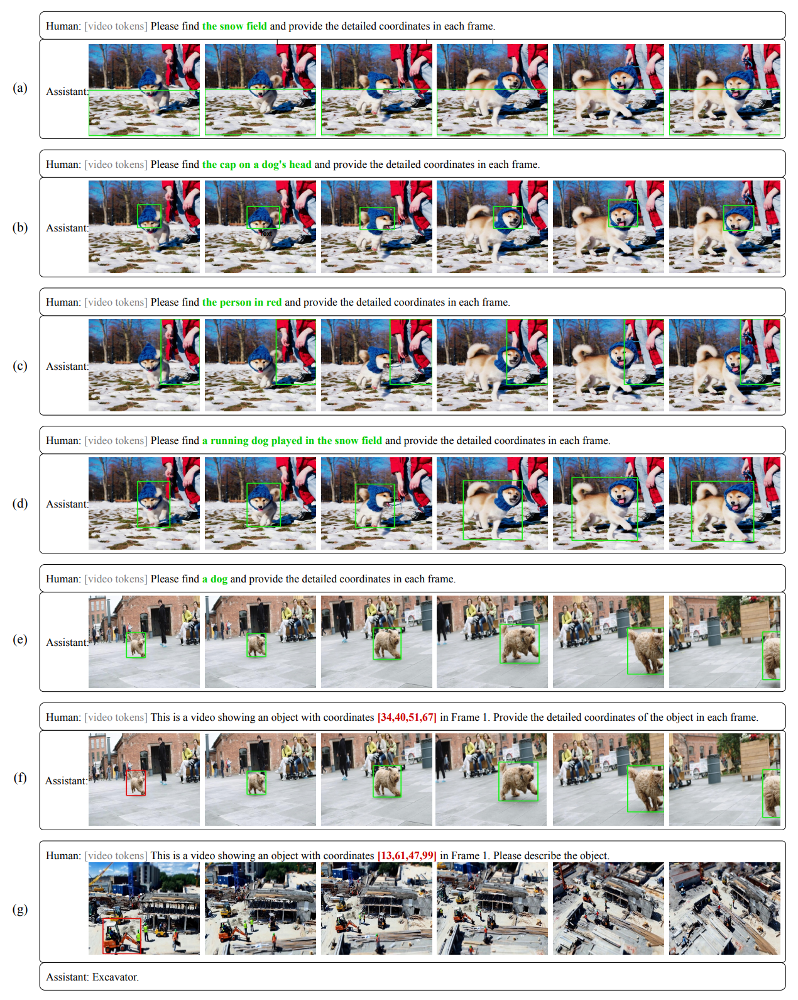

# Elysium


**MLLM can recognize and track anything in videos now!**

🚀🚀🚀 Official implementation of *Elysium: Exploring Object-level Perception in Videos via MLLM* in ECCV 2024.

[Project Page] [[Dataset](https://huggingface.co/datasets/sty-yyj/ElysiumTrack-1M)] [[Checkpoint](https://huggingface.co/sty-yyj/elysium_7b)]

[](https://paperswithcode.com/sota/zeroshot-video-question-answer-on-msrvtt-qa?p=elysium-exploring-object-level-perception-in)
[](https://paperswithcode.com/sota/zeroshot-video-question-answer-on-msvd-qa?p=elysium-exploring-object-level-perception-in)
[](https://paperswithcode.com/sota/zeroshot-video-question-answer-on-tgif-qa?p=elysium-exploring-object-level-perception-in)
[](https://paperswithcode.com/sota/zero-shot-single-object-tracking-on-lasot?p=elysium-exploring-object-level-perception-in)

## Abstract



Multi-modal Large Language Models (MLLMs) have demonstrated their ability to perceive objects in still images, but their application in video-related tasks, such as object tracking, remains understudied. This lack of exploration is primarily due to two key challenges. Firstly, extensive pretraining on large-scale video datasets is required to equip MLLMs with the capability to perceive objects across multiple frames and understand inter-frame relationships. Secondly, processing a large number of frames within the context window of Large Language Models (LLMs) can impose a significant computational burden.
To address the first challenge, we introduce ElysiumTrack-1M, a large-scale video dataset supported for three tasks: Single Object Tracking (SOT), Referring Single Object Tracking (RSOT), and Video Referring Expression Generation (Video-REG). ElysiumTrack-1M contains 1.27 million annotated video frames with corresponding object boxes and descriptions. Leveraging this dataset, we conduct training of MLLMs and propose a token-compression model T-Selector to tackle the second challenge. Our proposed approach, Elysium: Exploring Object-level Perception in Videos via MLLM, is an end-to-end trainable MLLM that attempts to conduct object-level tasks in videos without requiring any additional plug-in or expert models. 

## Release


- [2024/7/15] 🔥 **Elysium-7b** is released. The model supports the object-level perception tasks, encompassing both images and videos, like SOT, RSOT and Video-REG. [[Checkpoint](https://huggingface.co/sty-yyj/elysium_7b)]
  
- [2024/7/15] 🔥 **ElysiumTrack-1M** dataset is released. It is a million-scale object perception video dataset, which supports SOT, RSOT, and Video-REG. [[Dataset](https://huggingface.co/datasets/sty-yyj/ElysiumTrack-1M)]


## Demo Videos

**Referring Single Object Tracking (RSOT)**

We use prompt "Please find {expression} in the initial frame and provide the detailed coordinates in each frame." for each video.

|  |  |  |  |  |
|---|---|---|---|---|
| a running dog played in the snow field | the cap on a dog's head | the snow field | shoes | the person in red |

|  |  |  |
|---|---|---|
| boy back to camera | a dancing kangaroo | dog |

**Single Object Tracking (SOT)**

We use prompt "This is a video showing an object with coordinates {coordinates} in Frame 1. Provide the detailed coordinates of the object in each frame." for each video.

|  |  |
|---|---|
| [34,40,51,67] | [35,48,60,55] |

## Pipeline of ElysiumTrack-1M construction


## Content
- [Elysium](#elysium)
  - [Abstract](#abstract)
  - [Release](#release)
  - [Demo Videos](#demo-videos)
  - [Pipeline of ElysiumTrack-1M construction](#pipeline-of-elysiumtrack-1m-construction)
  - [Content](#content)
    - [Install](#install)
    - [Data Preparation](#data-preparation)
    - [Train](#train)
    - [Evaluation](#evaluation)
  - [Citation](#citation)

### Install

1. Clone this repository
  
  ```bash
  git clone https://github.com/sty-yyj/Elysium.git
  cd Elysium
  ```
  
2. Install Package
  
  ```Shell
  conda create -n elysium python=3.10 -y
  conda activate elysium
  pip install -r requirements.txt
  ```
  

### Data Preparation

You can directly download [ElysiumTrack-1M](https://huggingface.co/datasets/sty-yyj/ElysiumTrack-1M).

If you want to use your own data, please process it into the following annotation format

```json
{
    "source": ,
    "id": ,
    "vid": ,
    "metadata": ,
    "frames": [
        "frames/1025983634/000000.jpg",
        ...
    ],
    "object_class": ,
    "box": [
        [
            0.36073825503355705,
            0.1488095238095238,
            0.6694630872483222,
            0.9583333333333334
        ]
        ...
    ],
    "object_description": ,
    "frame_size": [
        w, h
    ]
}
```

### Train

Refer to `config.sample_config.yaml`, fill the correct data path into `data.train.data_fetch.data_paths`, and then start the command

```
deepspeed training/train.py --config {YOUR_CONFIG_PATH}
```

### Evaluation

We provide the eval script to ensure the reproducibility of our results. Here we introduce how to reproduce our metrics on LaSOT.

Firstly, you need to process the annotations of LaSOT into [json format](#data-preparation), which is consistent with the format of the training set.

Secondly, Refer to `config.sample_config.yaml`, fill the correct data path into `data.predict.data_fetch`, and then start the command. Since LaSOT consists of very long videos, during model inference, it will be processed by taking one slice **every 8 frames**.

```
deepspeed eval/eval.py --config {YOUR_CONFIG_PATH} --task SOT
```

Finally, Run the following command to obtain the metric results

```
python eval/otb.py {PATH_TO_INFER_RESULT}
```

## Citation

If you find our work helpful for your research, please consider giving a star ⭐ and citation 📝.

```
@misc{wang2024elysiumexploringobjectlevelperception,
      title={Elysium: Exploring Object-level Perception in Videos via MLLM}, 
      author={Han Wang and Yongjie Ye and Yanjie Wang and Yuxiang Nie and Can Huang},
      year={2024},
      eprint={2403.16558},
      archivePrefix={arXiv},
      primaryClass={cs.CV},
      url={https://arxiv.org/abs/2403.16558}, 
}
```