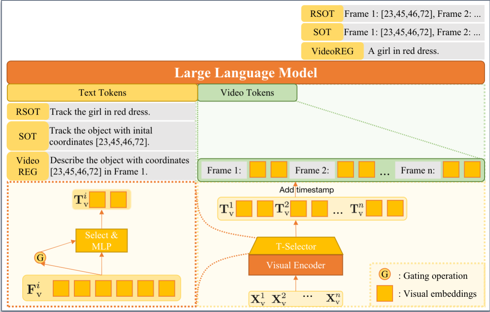
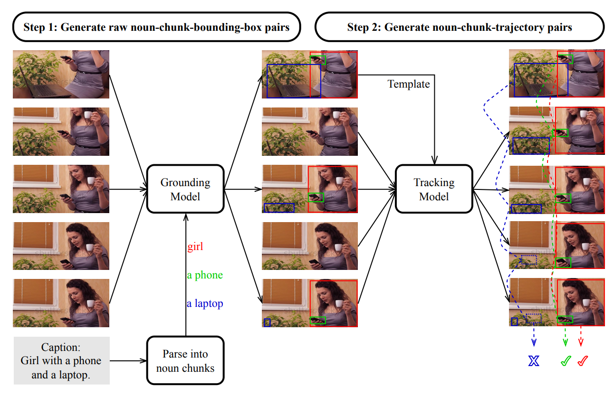

# Elysium

---

🚀🚀🚀 Official implementation of *Elysium: Exploring Object-level Perception in Videos via MLLM* in ECCV 2024.



[Project Page] [[Dataset](https://huggingface.co/datasets/sty-yyj/ElysiumTrack-1M)] [[Checkpoint](https://huggingface.co/sty-yyj/elysium_7b)]


## Release


- [2024/7/15] 🔥 **Elysium-7b** is released. The model supports the object-level perception tasks, encompassing both images and videos, like SOT, RSOT and Video-REG. [[Checkpoint](https://huggingface.co/sty-yyj/elysium_7b)]
  
- [2024/7/15] 🔥 **ElysiumTrack-1M** dataset is released. It is a million-scale object perception video dataset, which supports SOT, RSOT, and Video-REG. [[Dataset](https://huggingface.co/datasets/sty-yyj/ElysiumTrack-1M)]
  

## Pipeline of ElysiumTrack-1M construction



## Content
- [Install](#install)
- [Data Preparation](#data-preparation)
- [Train](#train)
- [Evaluation](#evaluation)

### Install

1. Clone this repository
  
  ```bash
  git clone https://github.com/sty-yyj/Elysium.git
  cd Elysium
  ```
  
2. Install Package
  
  ```Shell
  conda create -n elysium python=3.10 -y
  conda activate elysium
  pip install -r requirements.txt
  ```
  

### Data Preparation

You can directly download [ElysiumTrack-1M](https://huggingface.co/datasets/sty-yyj/ElysiumTrack-1M).

If you want to use your own data, please process it into the following annotation format

```json
{
    "source": ,
    "id": ,
    "vid": ,
    "metadata": ,
    "frames": [
        "frames/1025983634/000000.jpg",
        ...
    ],
    "object_class": ,
    "box": [
        [
            0.36073825503355705,
            0.1488095238095238,
            0.6694630872483222,
            0.9583333333333334
        ]
        ...
    ],
    "object_description": ,
    "frame_size": [
        w, h
    ]
}
```

### Train

Refer to `config.sample_config.yaml`, fill the correct data path into `data.train.data_fetch.data_paths`, and then start the command

```
deepspeed training/train.py --config {YOUR_CONFIG_PATH}
```

### Evaluation

We provide the eval script to ensure the reproducibility of our results. Here we introduce how to reproduce our metrics on LaSOT.

Firstly, you need to process the annotations of LaSOT into [json format](#data-preparation), which is consistent with the format of the training set.

Secondly, Refer to `config.sample_config.yaml`, fill the correct data path into `data.predict.data_fetch`, and then start the command. Since LaSOT consists of very long videos, during model inference, it will be processed by taking one slice **every 8 frames**.

```
deepspeed eval/eval.py --config {YOUR_CONFIG_PATH} --task SOT
```

Finally, Run the following command to obtain the metric results

```
python eval/otb.py {PATH_TO_INFER_RESULT}
```

## Citation

If you find our work helpful for your research, please consider giving a star ⭐ and citation 📝.

```
@misc{wang2024elysiumexploringobjectlevelperception,
      title={Elysium: Exploring Object-level Perception in Videos via MLLM}, 
      author={Han Wang and Yanjie Wang and Yongjie Ye and Yuxiang Nie and Can Huang},
      year={2024},
      eprint={2403.16558},
      archivePrefix={arXiv},
      primaryClass={cs.CV},
      url={https://arxiv.org/abs/2403.16558}, 
}
```